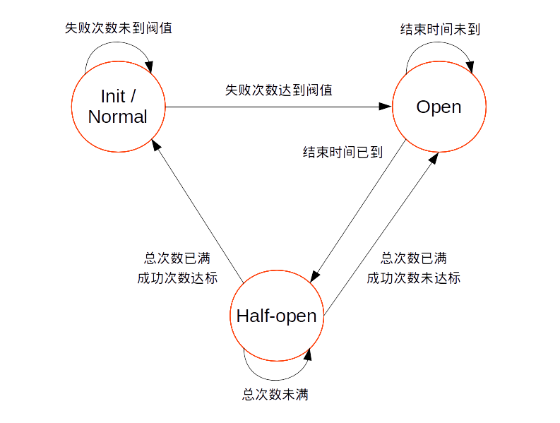

Name
====

fuse

熔断插件

Description
===========

三种状态：正常、断开、半断开

断开状态下，以及半断开状态下请求配额已满而配额请求还未全部返回时，所有的请求不予通过

状态转移图：



在 `access` 阶段：确定请求是否予以通过，不通过是返回设置的熔断状态码和响应体；在半断开状态下获取请求配额

在 `log` 阶段：在正常状态下，对错误请求进行计数；半断开状态下，对请求和成功次数进行计数

Synopsis
========

```yaml
locations:
  - plugins:
      fuse:
        key: k
        interval: 60
        codes: [502, 504]
        threshold: 100
        fuse_dur: 180
        fuse_code: 599
        fuse_body: "{}"
        recover_threshold: 5
        recover_success: 4
        kafka_instance: k1
        kafka_topic: tt
```

Dependencies
============

* Consul agent >= 0.8.3

Configuration
=============

* `key` string: 计数器的 key，可以不同路由使用不同的 key，也可以多个路由使用相同的 key 来联动熔断

* `interval` int: 计数器的有效期，单位秒，默认 `10`

* `codes` array \[ int \]: 错误状态码的集合，默认 `[ 502, 504 ]`。这里检查的是 Nginx 的最终输出值，对于 proxy pass 超时的情况，Nginx 会输出 `504`

* `threshold` int: 错误阀值，默认 `100`

* `fuse_dur` int: 熔断时长，单位秒，默认 `10`

* `fuse_code` int: 熔断状态码，默认 `503`

* `fuse_body` string: 熔断响应体，默认 `{}`

* `recover_threshold` int: 半断开的请求次数，默认 `5`

* `recover_success` int: 半断开的成功请求数下限，默认 `4`

* `kafka_instance` string: 发送事件消息，在总体配置的 `kafka.instances` 下配置的 Kafka 实例名称，默认 `nil`，即不发送

* `kafka_topic` string: 发往的 Kafka topic

发送的消息为一个 json 字符串，json decode 后为如下形式：

```javascript
{
    topic: "tt", // kafka topic
    type: "fuse",
    timestamp: 1388888888,
    instance: {
        group_id: "gg",
        instance_id: "biz01:24800", // hostname:nginx master process id
        worker_id: 0, // nginx worker id
        worker_pid: 24801, // nginx worker process id
    },

    location_id: "tt", // 路由项中配置的 id
    state: "normal"
}
```
